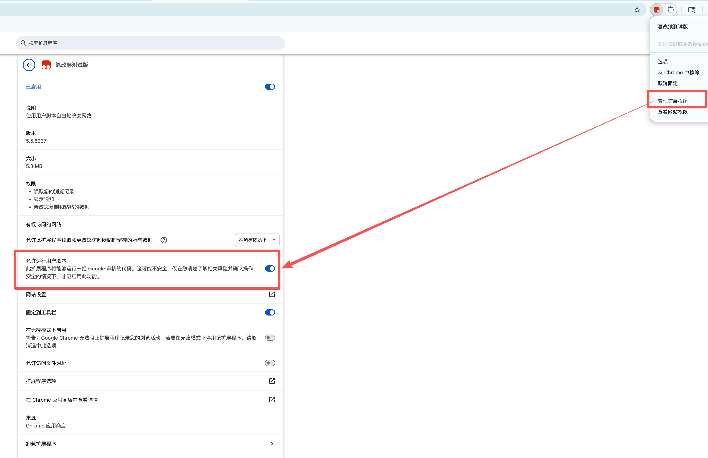

# ChatGPT Revised Prompt Extractor

> Extract and manage the hidden optimized image generation prompts from ChatGPT — with thumbnails, batch download, and round-based grouping.

[English](#english) | [中文](#中文)

---

## English

### What is this?

When you ask ChatGPT to generate images using DALL-E 3 / GPT-image-2, it internally rewrites your original prompt into a much more detailed and optimized version before sending it to the image model. This **revised prompt** is usually hidden from you — this userscript surfaces it.

A floating button (🖌) appears in the bottom-right corner on ChatGPT conversation pages. Click it to manually extract revised prompts and open the management panel; use the panel's **Extract** button to refresh.

### Features

**Core**
- ✅ Extracts revised prompts from ChatGPT image generation conversations
- ✅ Manual extraction — no background API polling until you click
- ✅ Multi-strategy extraction (code blocks, tool messages, DALL-E metadata)
- ✅ Cleans up internal control tokens like `<|has_watermark|>`

**v5.2 — Advanced Robustness & Bug Fixes**
- 🔄 **Reliable Multi-turn Prompt Extraction** — Resolved the bug where only the first turn's prompts were extracted, by replacing the linear traversal chain with a full DFS mapping tree and sorting images by creation time.
- 🛡️ **User-Uploaded Image Filtering** — Implemented 3-layer filtering (DOM role checks, backend file ID blacklist, context exclusion) to prevent user-uploaded source photos from leaking into the script panel as generated output.

**v5.0 — Visual Management & Batch Downloads**
- 🖼️ **Thumbnail hover preview** — hover over any thumbnail to smoothly reveal a large, uncropped high-res preview
- ☑️ **Multi-select & ZIP Batch download** — download all, selected, or per-round images dynamically packaged into a `.zip` archive
- 🔲 **Round grouping** — multi-turn conversations are visually separated with dividers and dedicated "Download Round" buttons
- 🛡️ **Token refresh** — handles API `401 Unauthorized` token expirations during manual extraction
- 🚦 **Manual rate control** — avoids repeated background polling and shows a retry hint if ChatGPT returns `429 Too Many Requests`

**UI/UX**
- ✅ Floating button with badge count — non-intrusive, always accessible
- ✅ Collapsible cards per prompt — keeps UI clean for multi-image sessions
- ✅ One-click copy to clipboard
- ✅ Dark mode compatible
- ✅ SPA navigation aware — resets on conversation switch

### Installation

1. Install the [Tampermonkey Beta](https://chromewebstore.google.com/detail/tampermonkey-beta/gcalenpjmijncebpfijmoaglllgpjagf) browser extension.
2. Install the script via one of the following methods:

   **Option A — GreasyFork (recommended):**
   [📦 Install from GreasyFork](https://greasyfork.org/scripts/575990)

   **Option B — GitHub raw link:**
   [📦 Install from GitHub](https://raw.githubusercontent.com/kadevin/chatgpt-revised-prompt/main/chatgpt_revised_prompt_extractor.user.js)

   **Option C — Manual:** open Tampermonkey Dashboard → **Create new script** → paste the contents of `chatgpt_revised_prompt_extractor.user.js`.

3. Make sure **"Allow userscripts on this site"** is enabled in Tampermonkey for `chatgpt.com`.

4. In Chrome's extension details page, open **Manage extension** and enable **Allow User Scripts**.

   

5. Navigate to any ChatGPT conversation that contains generated images, then click the floating button or **Extract** in the panel.

### How it works

When you click **Extract**, the script requests the ChatGPT backend API (`/backend-api/conversation/{id}`) using your existing session token (extracted from the `#client-bootstrap` element). It then traverses the conversation mapping tree using multiple extraction strategies:

| Strategy | Source | Description |
|----------|--------|-------------|
| A | `assistant` code messages | Parses `image_gen.text2im(prompt=...)` Python-style calls |
| B | `tool` multimodal_text messages | Extracts `Model caption: ...` strings and part metadata |
| C | `tool` asset_pointer | Resolves `file-service://file-xxxx` → DOM image matching |
| D | Message `metadata.dalle` | Traditional DALL-E metadata field |
| E | `metadata.image_generation` | Image generation metadata object |
| F | `metadata.aggregate_result.dalle` | Aggregate result prompts array |

**Image Resolution**: Images are matched via a 3-tier strategy — first by `asset_pointer` file ID lookup in DOM, then by `data-message-id` DOM query, and finally by sequential assignment of unmatched DOM images. A delayed retry (3s) ensures images that load after API data are also captured.

### Permissions

The script uses `@grant none`, meaning it runs in the page's own JavaScript context. This is required to access `window.fetch` and the session token — **no external requests are made**, everything stays within your existing ChatGPT session.

### Compatibility

| Browser | Status |
|---------|--------|
| Chrome + Tampermonkey | ✅ Tested |
| Firefox + Tampermonkey | ✅ Should work |
| Edge + Tampermonkey | ✅ Should work |
| Safari + Userscripts | ⚠️ Untested |

---

## 中文

### 这是什么？

当你要求 ChatGPT 使用 DALL-E 3 / GPT-image-2 生成图片时，它会在内部将你的原始提示词改写成一个更详细、更优化的版本，再发送给图像模型。这个**优化后的提示词（revised prompt）** 通常对用户是隐藏的 —— 这个油猴脚本就是用来将它提取并显示出来的。

在 ChatGPT 对话页中，页面右下角会出现一个悬浮按钮（画笔图标）。点击后会手动提取优化提示词并展开管理面板；也可以在面板中点击「提取」重新刷新。

### 功能特性

**核心功能**
- ✅ 提取 ChatGPT 图片生成对话中的优化提示词
- ✅ 手动提取，不在后台自动轮询 API
- ✅ 多策略提取（代码块、tool 消息、DALL-E metadata）
- ✅ 自动清除 `<|has_watermark|>` 等内部控制标记

**v5.2 — 鲁棒性增强与缺陷修复**
- 🔄 **可靠的多轮对话提取** — 重构了提示词路径搜索算法，用完整的深度优先搜索 (DFS) 和创建时间排序替代单链遍历，解决多轮对话下可能只显示第一轮提示词的问题。
- 🛡️ **精确过滤用户上传图** — 引入 DOM 位置校验（排除 user 消息）、file ID 黑名单和过滤传递等三级防御机制，防止用户自己上传的参考图被错误加载到脚本面板中。

**v5.0 — 视觉化管理与批量下载**
- 🖼️ **缩略图悬浮预览** — 鼠标悬停在提示词缩略图上时，左侧会平滑浮出无裁切的高清大图预览
- 📥 **ZIP 批量打包下载** — 支持“下载全部”、“下载选中”以及“单轮下载”，所有批量下载会自动打包为 `.zip` 文件，告别浏览器弹窗风暴
- 🔲 **对话轮次分组** — 多轮生成的图片会通过分割线清晰分组，每组带有独立的“下载本轮”按钮
- 🛡️ **Token 自动刷新** — 手动提取时处理长时间挂机导致的 API `401` 错误
- 🚦 **手动限流机制** — 避免后台重复轮询；如果触发 ChatGPT 的 `429` 频率限制，会提示稍后手动重试

**界面体验**
- ✅ 悬浮按钮 + 角标计数，不遮挡页面内容
- ✅ 每条提示词独立折叠卡片，多图场景下界面整洁
- ✅ 一键复制到剪贴板
- ✅ 支持暗色模式
- ✅ 感知 SPA 导航，切换对话时自动重置

### 安装方法

1. 安装 [Tampermonkey Beta](https://chromewebstore.google.com/detail/tampermonkey-beta/gcalenpjmijncebpfijmoaglllgpjagf) 浏览器扩展。
2. 通过以下任意方式安装脚本：

   **方式 A — GreasyFork（推荐）：**
   [📦 从 GreasyFork 安装](https://greasyfork.org/scripts/575990)

   **方式 B — GitHub 直链：**
   [📦 从 GitHub 安装](https://raw.githubusercontent.com/kadevin/chatgpt-revised-prompt/main/chatgpt_revised_prompt_extractor.user.js)

   **方式 C — 手动安装：** 打开 Tampermonkey 管理面板 → **创建新脚本** → 粘贴 `chatgpt_revised_prompt_extractor.user.js` 的内容。

3. 确保在 Tampermonkey 中为 `chatgpt.com` 启用了**「允许在此站点运行用户脚本」**。

4. 在 Chrome 扩展详情页中，打开**「管理扩展程序」**，并开启**「允许运行用户脚本」**。

   

5. 打开任意包含生成图片的 ChatGPT 对话，然后点击悬浮按钮或面板里的「提取」。

### 技术原理

点击「提取」后，脚本利用页面中已有的会话 token（从 `#client-bootstrap` 元素提取），请求 ChatGPT 的后端 API（`/backend-api/conversation/{id}`），再对对话消息树进行多策略遍历：

| 策略 | 数据来源 | 说明 |
|------|---------|------|
| A | `assistant` code 消息 | 解析 `image_gen.text2im(prompt=...)` Python 风格调用 |
| B | `tool` multimodal_text 消息 | 提取 `Model caption: ...` 字符串及 part 元数据 |
| C | `tool` asset_pointer | 解析 `file-service://file-xxxx` → DOM 图片匹配 |
| D | 消息 `metadata.dalle` | 传统 DALL-E metadata 字段 |
| E | `metadata.image_generation` | 图片生成元数据对象 |
| F | `metadata.aggregate_result.dalle` | 聚合结果的 prompts 数组 |

**图片解析**：采用三级策略匹配 — 首先通过 `asset_pointer` 的 file ID 在 DOM 中查找，其次通过 `data-message-id` 定位，最后按顺序分配剩余 DOM 图片。并有 3 秒延迟重试机制确保延迟加载的图片也能被捕获。

### 权限说明

脚本使用 `@grant none`，即在页面自身的 JavaScript 上下文中运行。这是访问 `window.fetch` 和会话 token 的必要条件 —— **脚本不会发起任何外部请求**，所有操作均在你现有的 ChatGPT 会话内进行。

### FAQ

**Q: 脚本安装后没有任何显示？**  
A: 请确认 Tampermonkey 中已为 `chatgpt.com` 启用「允许运行用户脚本」，并刷新页面。

**Q: 悬浮按钮出现了，但点击后面板是空的？**  
A: 请先确认图片已经生成完成，然后点击悬浮按钮或面板里的「提取」。如果仍为空，这条对话可能没有可提取的 revised prompt，或 ChatGPT 的返回结构已变化。

**Q: 提示词获取是实时的吗？**  
A: 不是。现在改为手动触发 API 请求，避免频繁后台轮询；MutationObserver 只在已有提示词时用于补充匹配延迟加载的图片。

**Q: 图片缩略图没有显示？**  
A: 图片匹配依赖 DOM 加载时机，首次可能需要等待 3 秒的延迟重试。如果仍无显示，请打开浏览器控制台（F12）搜索 `[RP]` 日志协助排查。

---

## License

MIT License — free to use, modify, and distribute.

## Contributing

Pull Requests and Issues are welcome! If ChatGPT updates their API structure and the script breaks, please open an issue with the conversation API response snippet.

---

## 联系作者 / Contact

欢迎添加微信交流 **AI 编程** 和 **AI 生图** 经验，一起探索更多玩法 🤝

Feel free to connect on WeChat to discuss **AI programming** and **AI image generation** tips!

  

